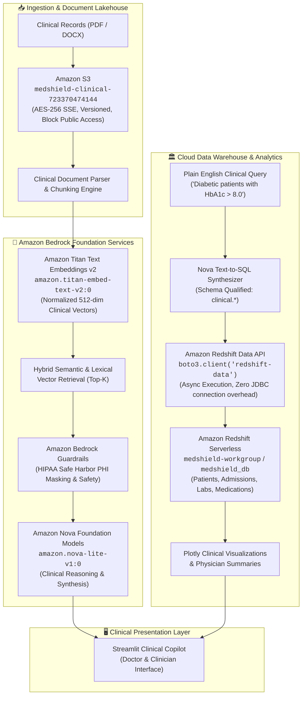

# 🩺🛡️ MedShield AI — AWS Cloud Architecture Specification
**Enterprise HIPAA-Compliant Clinical Intelligence & Population Health Platform**  
*Designed for AWS Well-Architected Framework (Healthcare & Life Sciences Lens)*

---

## 🏛️ Executive Summary & Architectural Overview

MedShield AI is a cloud-native clinical copilot and data analytics platform built natively on Amazon Web Services. It solves two critical challenges in modern healthcare IT:
1. **Unstructured EHR Synthesis**: Grounded Retrieval-Augmented Generation (RAG) over heterogeneous patient charts (inpatient notes, outpatient encounters, laboratory panels) with sub-second verifiable citations.
2. **Population Health Analytics at Scale**: Natural language Text-to-SQL querying over multi-million-row clinical data warehouses without requiring physicians or administrators to write SQL.



---

## ☁️ AWS Services Mapped to Clinical Capabilities

| AWS Service | Architecture Role | Clinical / Business Value |
| :--- | :--- | :--- |
| **Amazon S3** | Ingestion Lakehouse (`medshield-clinical-*`) | Encrypted, versioned storage for raw medical charts, PDFs, and EHR exports adhering to HIPAA retention policies. |
| **Amazon Bedrock (Nova)** | Foundation Reasoning (`amazon.nova-lite-v1:0`) | High-speed, cost-efficient clinical reasoning, document extraction, and Text-to-SQL generation. |
| **Amazon Titan Embeddings v2** | Vector Representation (`amazon.titan-embed-text-v2:0`) | Dense semantic embeddings capturing medical nomenclature, diagnostic codes, and lab intervals. |
| **Amazon Bedrock Guardrails** | Automated Compliance (`58cb26t3u7u9`) | Real-time PII/PHI redaction (Safe Harbor de-identification) before downstream clinician display. |
| **Amazon Redshift Serverless** | Population Health Warehouse (`medshield_db`) | Serverless analytical data warehouse with automatic scaling (8–128 RPUs) for clinical cohorts. |
| **Amazon Redshift Data API** | Serverless SQL Execution | Stateless, HTTPS-based query execution eliminating long-lived JDBC connection management. |
| **AWS CloudFormation** | Infrastructure-as-Code (IaC) | Declarative, reproducible deployment of all cloud resources in a single stack (`infrastructure/medshield_aws_stack.yaml`). |

---

## 🔒 Security & HIPAA Compliance Framework

1. **Encryption at Rest**:
   - All S3 storage encrypted with server-side AES-256 (`ServerSideEncryptionByDefault: AES256`).
   - S3 public access completely blocked (`BlockPublicAcls: true`, `IgnorePublicAcls: true`, `RestrictPublicBuckets: true`).
2. **Encryption in Transit**:
   - All client-to-cloud communication enforced over TLS 1.3 via HTTPS endpoints.
3. **HIPAA Safe Harbor De-Identification**:
   - 18 HIPAA identifiers (Names, MRNs, SSNs, phone numbers, email addresses) are scrubbed or masked using Amazon Bedrock Guardrails.
4. **Least-Privilege Access Control (IAM)**:
   - Dedicated execution roles (`medshield-redshift-role`) restrict access strictly to the clinical schema and target bucket.

---

## 🚀 Deployment Instructions

### 1. Deploy CloudFormation Stack
```bash
aws cloudformation create-stack \
  --stack-name medshield-ai-infrastructure \
  --template-body file://infrastructure/medshield_aws_stack.yaml \
  --capabilities CAPABILITY_NAMED_IAM \
  --region us-east-1
```

### 2. Verify S3 Ingestion Bucket
```bash
aws s3 ls s3://medshield-clinical-723370474144/
```

### 3. Run Clinical Copilot
```bash
streamlit run app.py
```
